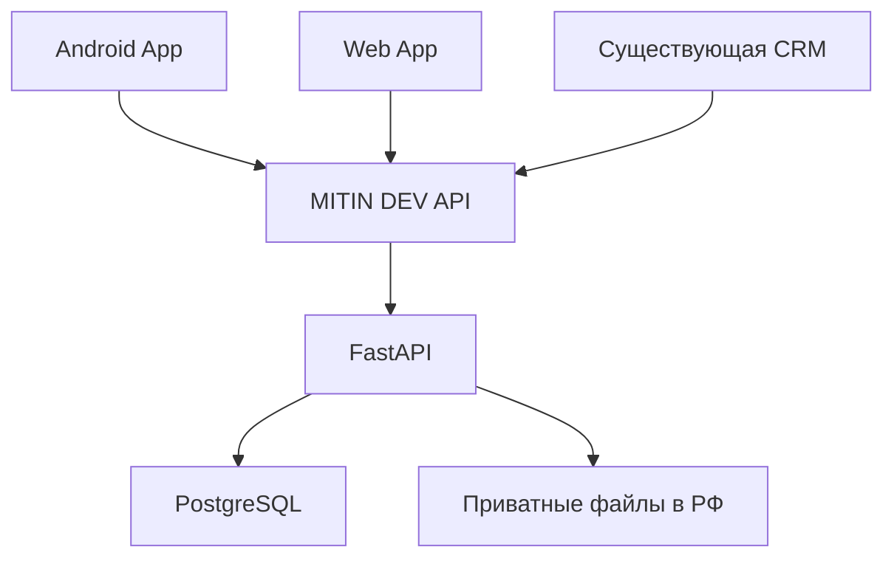

# MITIN DEV — будущая архитектура приложения

Проектирование, без реализации backend. 06.09.2026. Никаких миграций, подключений и изменений существующей CRM в этой ветке.

## Один backend и один источник фактов

MITIN DEV API — контракт существующей системы, реализуемый в FastAPI, а не отдельная новая CRM. Android/Web никогда не получают строку подключения, пароль или прямой доступ к PostgreSQL. Аналогично, постоянные credentials файлового хранилища не попадают в приложение.

В настоящем прототипе нет ни одного из этих сетевых соединений. React Preview читает вымышленный документ Canvas и меняет локальные строки в памяти до закрытия. Нативный редактор M3E может сохранять **дизайн** в localStorage; введённые в Preview значения туда не записываются.

## Границы доступа

| Операция | Client | Owner |
| --- | --- | --- |
| Читать заявку / проект | Только свои | Все в области администрирования MITIN DEV |
| Менять договорную цену / этап | Нет | Да, с audit log |
| Материалы и сообщения | Только в своём проекте | В доступных проектах |
| Согласовать демо | Только клиент связанного проекта | Видеть решение, не выдавать себя за клиента |
| Аналитика | Нет доступа к бизнес-выборке | Admin-only |
| Менять роль | Нет | Только отдельная административная процедура |

Будущие роли: `client` и `owner`. Ответ `/me` после входа задаёт доступные разделы, но скрытие кнопок не является защитой. Авторизацию проверяет backend при каждом чтении и изменении.

`client_id`, `user_id`, `owner`, `role`, project IDs и пути файлов из frontend не считаются достоверными. Backend определяет субъекта по валидированной сессии; идентификатор ресурса из URL служит только для поиска. Затем проверяются принадлежность проекта клиенту и разрешение на операцию. Фильтрация по субъекту обязательна и для списков, и для карточек, и для файлов/сообщений/вложенных сущностей. Самостоятельно назначить `owner` при регистрации невозможно.

Будущие обязательные проверки: клиент A не видит заявку, проект, сообщения, файлы и ссылки клиента B; подмена ID/роли в запросе не даёт доступа; скрытые поля цены/статуса не меняются через массовое присваивание; заблокированная сессия прекращает доступ. Проверять в backend, не только UI-тестами.

## Auth concept

- HTTPS only для API, Web и выдачи файлов. В Android запретить cleartext traffic. Не использовать query string для токенов.
- Короткоживущий access token; подпись, issuer, audience, срок и отзыв сессии проверяет API.
- Refresh token с ротацией; на сервере — хэш, идентификатор сессии, срок и признак отзыва. Повторное использование заменённого refresh token отзывает семейство сессии.
- Android: access token преимущественно в памяти. Refresh token шифруется ключом Android Keystore; закрытый ключ не экспортируется. Не хранить токены открытым текстом в preferences, логах, backup или Canvas.
- Web: предпочтительно защищённая серверная сессия/BFF либо Secure + HttpOnly cookie для refresh; решение закрепить перед реализацией. Для cookie-based изменений — CSRF и проверка Origin/SameSite. Не помещать долговечные credentials в localStorage.
- Revocation: выход с устройства, выход со всех устройств, отзыв администратором, компрометация refresh token. Очистка локального состояния после выхода; возврат назад не раскрывает данные прошлой сессии.
- Owner — admin-only. Выдача роли — доверенная административная процедура, при необходимости отдельный усиленный вход; публичного owner signup нет.
- Демонстрационный выбор роли и список экранов Canvas не переносить в production.

Это план требований, не заявление о реализованной безопасности. Prototype не обеспечивает изоляцию ролей и не предназначен для реальных данных.

## Сущности: проектирование

Схема существующего `bizflow-business-system` здесь не изучалась. Ниже — **кандидаты для сопоставления**, а не утверждение о текущих колонках/связях CRM. Перед реализацией сначала read-only инвентаризация существующих моделей и контрактов, затем переиспользование; только после этого отдельное согласование изменений схемы.

| Сущность | Назначение и будущие связи | Источник фактов / правила |
| --- | --- | --- |
| User | Аутентифицированный субъект, роль, состояние сессии; связь с ClientProfile | Переиспользовать существующего пользователя/администратора, если модель подходит; не создавать второй identity store |
| ClientProfile | Профиль клиента для доступа к нескольким своим проектам; связь с User и CRM-клиентом | Не копировать контакты во все проекты; связь с существующим клиентом, если он уже есть |
| Project | Связь с клиентом и исходным Lead; название, состояние, согласованные условия, следующий шаг | Один проект используется CRM и приложением; `source_lead_id` и идемпотентность конвертации исключают дубль |
| ProjectStage | Project, тип этапа, порядок, статус, выполненные/текущие работы, ожидания | ТЗ / дизайн / разработка / проверка / запуск / сопровождение; статус по enum ниже |
| ProjectMessage | Обсуждение внутри Project; автор, время, видимость, ссылка на внешний оригинал при выбранной интеграции | До выбора модели каналов считать проектным сообщением; не дублировать MessengerMessage автоматически |
| ProjectFile | Метаданные файла, Project, тип материала, storage key, размер, автор, состояние проверки | Содержимое в приватном российском объектном хранилище; БД хранит метаданные |
| ProjectPayment | Факт платежа/ссылка на существующий платёжный учёт проекта | Не второй ledger; статус и сумма из действующего источника оплаты, без самостоятельного приёма платежа в MVP |
| SupportRequest | Project, автор, тип проблема/доработка, состояние, связь с обсуждением | Использовать существующую поддержку/задачу, если подходит; не создавать параллельные тикеты |

### Статусы этапов

| Код | Подпись |
| --- | --- |
| `not_started` | Не начат |
| `in_progress` | В работе |
| `waiting_client` | Ожидаем клиента |
| `completed` | Завершён |

Текущий этап — отдельный явный факт проекта. Проценты показывать только при определённой системой модели расчёта; в этом прототипе процентов прогресса нет. Договорённости, сроки и суммы не выводятся из бюджета или текста AI.

### Переиспользование существующих сущностей CRM

| Существующая сущность | Переиспользование | Что не дублировать |
| --- | --- | --- |
| Lead | Единая заявка из приложения, сайта и каналов; существующий `budget_range`; AI-бриф как часть существующего процесса | Новую таблицу «app_leads», независимые контакты/статусы и отдельную воронку |
| MessengerConversation | При выборе интеграции каналов связать существующий диалог с клиентом/проектом после проверки принадлежности | Копию разговора только ради мобильного интерфейса |
| MessengerMessage | При проксировании — отображать оригинал с разрешённой проекцией и сохранённым external ID | Повторно сохранённый текст/вложения и повторную доставку как нового сообщения |
| PortfolioReview | После завершения при отдельном разрешении можно связать существующий отзыв с Project | Вторую базу отзывов; внутренний комментарий не становится публичным отзывом автоматически |

Решение о чате остаётся открытым: собственное проектное обсуждение, комментарии проекта или доступная проекция существующих каналов. Прототип показывает только простое проектное обсуждение. Автоматическое подключение MAX/VK/Telegram из него не следует.

## Предлагаемый API-контракт, без endpoints в этой ветке

| Область | Предлагаемые операции | Проверка |
| --- | --- | --- |
| Session | Вход, refresh, `/me`, отзыв сессий | Состояние User, подлинность сессии, роль |
| Leads | Своя заявка/бриф; owner список, статус, конвертация | Автор/владелец, допустимые поля, идемпотентность |
| Projects | Список своих, карточка, стоимость, договорённости | Принадлежность проекта субъекту |
| Stages | Чтение; изменение владельцем | Owner, версия записи, audit log |
| Demo review | Версия демо, решение, комментарий | Свой проект, актуальная версия, автор решения |
| Files | Метаданные, инициирование/завершение upload, получение | Свой проект, MIME/лимит, приватный storage key |
| Messages | Чтение/добавление в проект | Свой проект, автор из сессии, rate limiting |
| Support | Создание/чтение обращения | Свой проект, разрешённые статусы |
| Analytics | Агрегации CRM | Owner-only, явная выборка и период |

Названия URL и DTO согласовать с уже существующими контрактами. Прототип не вводит параллельный backend. Для конвертации Lead→Project и согласования демо нужны идемпотентность и контроль версии: повторное нажатие/повтор запроса не создаёт дубль и не одобряет устаревшую версию.

## Персональные данные и размещение

Потенциальные данные: имя, телефон, email, сообщения, сведения проекта, файлы, договорные сведения. План размещения: российский сервер API, PostgreSQL и резервные копии в РФ, приватное объектное хранилище в РФ; конкретные услуги существующей инфраструктуры Timeweb уточнить при отдельной задаче подключения.

Перед production проверить маршруты всех интеграций, аналитики, AI и уведомлений; наличие российского хранилища само по себе не исключает трансграничную передачу. В прототипе необязательный AI helper M3E не активируется и ключи не вводятся. Исходный M3E загружает иконки/шрифты Google Fonts: для будущего приложения упаковать разрешённые шрифты и иконки локально, без такого сетевого обращения.

Privacy и consent должны соответствовать целям, категориям данных и реальному оператору. Для применимых согласий хранить версию текста, время, действие и связанный субъект; публикация отзыва отдельно от внутреннего согласования демо. Экран «Данные и доступ» является указателем будущей функции, а не политикой или согласием. Текущие legal/РКН документы не меняются; необходимость актуализации рассматривается отдельно после определения фактической обработки.

Retention: сроки по категории и основанию, отдельные правила для незавершённых заявок, активных проектов, договорных/платёжных фактов, сообщений, материалов, журналов и backup. Сроки из воздуха не назначать. Зафиксировать процедуру удаления/обезличивания, законные исключения и период истечения backup; после восстановления повторно применить удаления. До согласования нельзя считать бессрочное хранение допустимым.

Audit log: субъект, роль, действие, сущность/ID, время UTC, результат, correlation ID, при необходимости безопасный diff. Фиксировать изменение доступа, условий, статуса, оплаты и решения по демо. Не записывать токены, содержимое файлов или полные тексты сообщений в технические логи. Доступ к журналу — административный, с защитой от изменения и своим retention.

Файлы: лимиты размеров/типов, проверка содержимого, карантин/антивирус перед выдачей, запрет выполнения пользовательского контента, безопасные имена, временные ссылки только после проверки прав, отсутствие публичных списков bucket. Не доверять переданному frontend пути к файлу.

## Что понадобится перед реализацией

1. Сопоставить сущности и auth существующей CRM read-only, не начинать новый backend.
2. Определить модель проектного чата и конвертации Lead→Project, подтвердить enum бюджета.
3. Утвердить права, DTO, состояния ошибок/пустых данных, источник финансовых фактов и правила retention.
4. Отдельно проверить размещение и потоки данных, необходимые privacy/consent изменения.
5. По отдельной задаче реализовать backend-проверки и отрицательные тесты доступа, затем подключать приложение на тестовом контуре с синтетическими данными.

Техническая опора интерфейса Android: [Material 3 in Compose](https://developer.android.com/develop/ui/compose/designsystems/material3). Работа с интерактивностью текущего Canvas: [Next.js Server and Client Components](https://nextjs.org/docs/app/getting-started/server-and-client-components).
