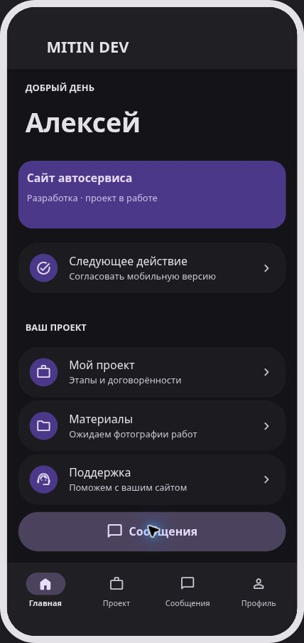
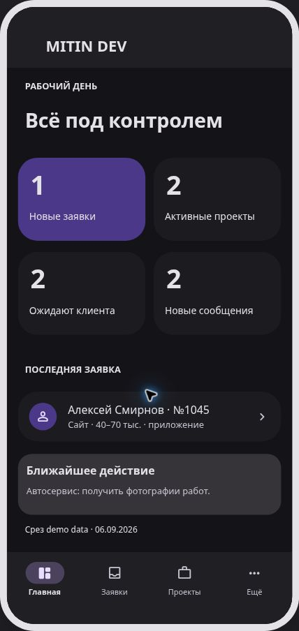
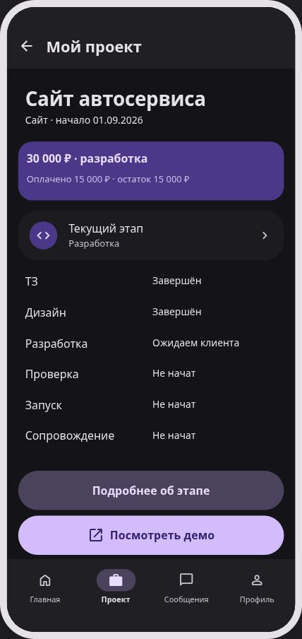
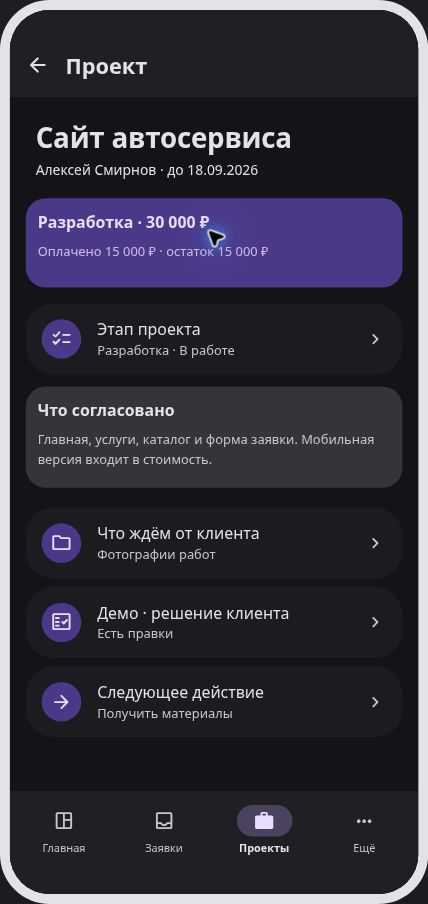
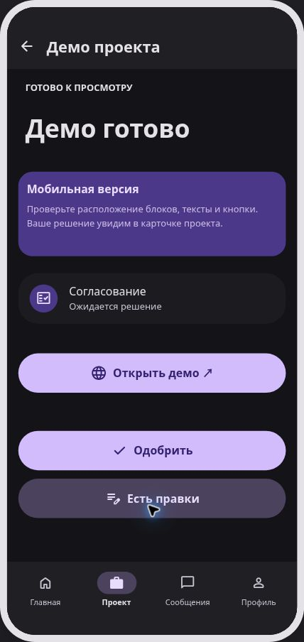
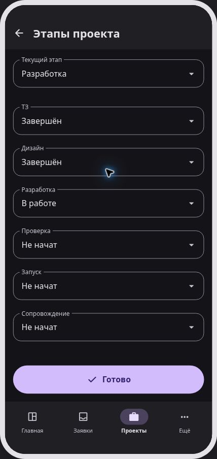

# MITIN DEV — проверка прототипа

Дата: 06.09.2026. Результат: оба основных сценария пройдены в нативном компоненте Preview M3E; импорт полного документа в редактор Canvas и редактирование поля в его Preview проверены отдельно.

## Проверенные сценарии

| Проверка | Результат / наблюдение |
| --- | --- |
| Welcome → Создать проект → Сайт → AI-бриф | Кнопки открывают соответствующие экраны |
| Ввод задачи → функции / бюджет → Проверить заявку | Изменённая задача и `40–70 тыс.` отображаются в подтверждении |
| Шесть вариантов бюджета | Dropdown содержит все варианты из задания, включая «пока не знаю» |
| Отправить заявку | Открывается «Заявка №1045 принята»; нет реального запроса |
| Принята → Главная → Проект → Этап → Демо | Полная обязательная цепочка пройдена |
| Открыть демо ↗ → вернуться | Внутренний макет, без перехода на реальный клиентский сайт |
| Есть правки → комментарий → сохранить | «Сделать кнопку записи синей» и «Есть правки» отображаются в результате |
| Demo picker → Владелец → Dashboard → Заявки → карточка | Владелец видит ту же изменённую задачу и `40–70 тыс.` |
| Принять в работу | Статус меняется на «В работе» |
| Создать проект → карточка → этапы | Новый проект связан с №1045; цена и срок не согласованы; шесть статусов доступны |
| Статус ТЗ нового проекта | Выбран «В работе», значение сохраняется при переходах внутри Preview |
| Проекты → Сайт автосервиса | Открывается отдельный существующий demo-проект p001 |
| Решение клиента в owner-проекте | Отображается «Есть правки» |
| Этапы p001 → Разработка → Ожидаем клиента | Изменение видно в клиентском «Мой проект» в той же сессии |
| Проект → Сообщения → ввод → Отправить | «Материалы готовы, можно продолжать» появляется как последнее сообщение; поле очищается |
| ArrowLeft / Backspace внутри поля | Редактируют текст; не уводят на предыдущий экран |
| Редактировать в Canvas → Keep this design → Preview | Все 52 фрейма импортированы; Welcome → Тип → Бриф и реальный ввод работают в Preview редактора |
| Android prompt | 112 127 символов нативного `buildPrompt`, English wrapper + русские подписи, platform=android; сохранён в MD |
| Console приложения | Ошибок с источником приложения не найдено; присутствовал шум расширения браузера, не приложения |

Основные пути проверены кликами. Для всех 52 экранов автоматизированно проверены достижимость из demo-входа и корректность всех action targets. Это не означает ручную проверку каждого возможного сочетания состояний и размеров экрана.

## Автоматические проверки

- `npm run typecheck` — passed.
- `npm test` — **454 passed**, 15 файлов, включая пять проверок прототипа.
- `npm run build` — passed, статические маршруты `/` и `/mitin-dev`.
- `git diff --check` — passed.
- Новые проверки покрывают: import/schema, уникальность идентификаторов, существование и достижимость переходов, общий budget/task, shared stage/comment state, неизменность исходного дизайна, исходный demo cohort, безопасную текстовую подстановку и отбраковку повреждённых bindings.

## Скриншоты

Снимки сделаны в работающем Preview. Они фиксируют разные моменты сценария: у клиента на скриншоте проекта уже показано изменение статуса владельцем.

| Клиент | Владелец |
| --- | --- |
|  |  |
|  |  |
|  |  |

Дополнительно: [Welcome](screenshots/mitin-dev/client-welcome.jpg), [редактор Canvas](screenshots/mitin-dev/canvas-editor.jpg).

## Что реально пригодилось в M3E Canvas

- Нативный JSON Doc/Frame/Group/Item, импорт проекта и share fragment — один редактируемый источник экранов.
- Телефонные фреймы 412×892, M3 карточки, списки, текст, поля, select, кнопки и нижняя навигация.
- Dark palette, emphasized typography, rounded shapes, expressive motion.
- `action` для кнопок/карточек, `actions` для отдельных пунктов bottom navigation и back, slide/fade transitions.
- Стрелки переходов на общем холсте; список экранов Preview для просмотра обеих ролей без переключателя в продукте.
- Нативный Preview: нажатия, анимации, select и навигация. Расширен только памятью для связанных полей и текстовым вводом.
- Нативный Android `buildPrompt`: имена, расположение, M3 стили, transitions и behavioral notes попадают в экспорт.

Tidy, генеративный AI helper, реальные загрузки изображений, ключи моделей, swipe gestures, отдельная CRM и внешние каналы не использовались.

## Обнаруженные ограничения

1. В исходном Preview текстовые поля были рисунками, а select не связывался с подтверждением. Добавлены опциональные memory-only bindings. Без этого расширения upstream открывает документ и переходы, но не переносит значения форм.
2. Это макет с локальными строками, не backend. Нет авторизации, защиты ролей, реального AI, оплаты, передачи сообщений или файлов. Не вводить реальные данные.
3. Списки фильтров и аналитика — исходный demo-срез, не реактивная CRM. Карточка изменённой заявки показывает актуальные local значения, но её принадлежность вкладке и агрегаты не пересчитываются.
4. Чат хранит один последний локальный текст с каждой стороны. История доставки, вложения, прочтение, пагинация и retry не реализованы.
5. «Добавить материалы» использует заранее заданное имя `work-example.jpg`, без чтения файла. Демо открывает внутренний пример сайта. Поддержка показывает отдельную стадию после запуска.
6. Фиксированные фреймы не заменяют адаптивную Android-вёрстку: длинный текст может обрезаться, нет полноценных scroll-контейнеров. Карточка этапа иллюстрирует разработку; подробности остальных этапов пока не расписаны.
7. У генератора нет русского обрамления prompt. Использован английский, все продуктовые подписи — русские. Экспорт велик из-за 52 экранов; Product Spec и Architecture задают приоритет ограничений над общими советами генератора.
8. При 52 экранах холст и стрелки плотные; для walkthrough удобнее отдельный `/mitin-dev/` entry того же Preview. Был один timeout автоматизации при быстром переходе на холсте; после проверки текущего экрана повторный клик сработал. Поля/переходы не сломаны.
9. Optional bindings редактируются в JSON/генераторе; отдельного Inspector для них нет. M3E сохраняет исходный дизайн, но не runtime-состояние Preview.
10. Исходный M3E загружает шрифты/иконки Google Fonts. Продакшен-архитектура требует отдельно решить локальную упаковку ресурсов; никаких реальных данных в этой проверке не было.
11. Модели существующей CRM и контракты auth не проверялись: документ архитектуры содержит план сопоставления, а не готовую миграцию/интеграцию.

## Границы результата

Изменён только `m3e-canvas`. Не изменялись `bizflow-business-system`, PostgreSQL, legal/РКН документы. Не создавались реальные аккаунты, не использовались production credentials, не отправлялись уведомления. Build — локальная проверка статического экспорта, не deploy. Ветка предназначена для отдельного PR без merge и без запуска публикации.

Инвентарь: 52 фрейма, 427 групп, 334 настроенных action/slot перехода.
